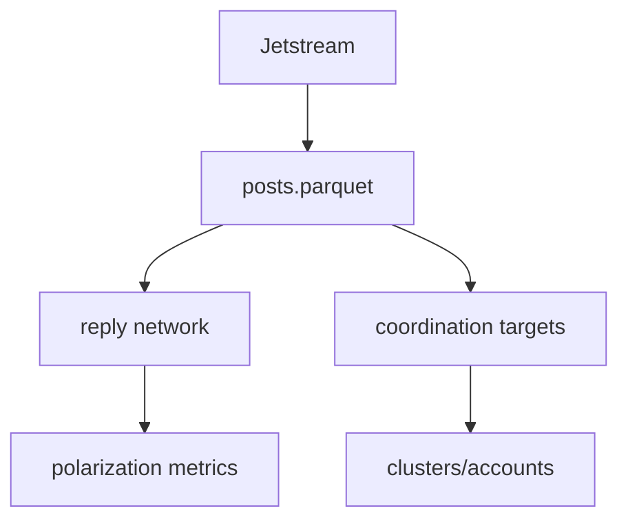

bluesky-polarization-coordination
Bluesky Jetstream ingest to reply networks, polarization metrics, and coordination signals.

What this repo does
- Bluesky Jetstream ingestion to parquet
- Reply network construction
- Polarization metrics on reply network (communities/modularity/cross_ratio)
- Coordination detection via shared reply targets within time windows
- Privacy: hashed identifiers (did_hash, reply_parent_did_hash)

Pipeline overview



Visual summary

```powershell
$clusters = Get-ChildItem artifacts\coordtargets_*_clusters.csv | Sort-Object LastWriteTime | Select-Object -Last 1
py -m src.render_report --clusters-csv $clusters.FullName --out-dir assets
```


This histogram shows how many accounts appear in each coordination cluster. The quickstart sample is small, so most bins may be sparse or empty. A longer live capture typically shifts mass toward larger clusters and fills more bins. In assets/top_clusters.md, a high top_target_share means a cluster concentrates on a single reply target within the time windows, which can signal synchronized attention. Treat it as a triage signal rather than proof of coordination.

Top clusters table: assets/top_clusters.md

Data and privacy
- Raw Jetstream events are not committed
- Stored identifiers are hashes of DIDs and reply targets
- data/sample/posts_sample.parquet is included for quickstart

Quickstart (no live capture, uses committed sample)

```powershell
py -m src.build_reply_network --in-parquet data\sample\posts_sample.parquet
$replynet = Get-ChildItem artifacts\replynet_*_summary.json | Sort-Object LastWriteTime | Select-Object -Last 1
$edges = $replynet.FullName -replace "_summary.json","_edges.parquet"
py -m src.polarization_reply --edges-parquet $edges --posts-parquet data\sample\posts_sample.parquet
py -m src.coordination_targets --in-parquet data\sample\posts_sample.parquet --window-minutes 10 --min-target-posts 2 --max-bucket-accounts 30
```

Artifacts are generated under artifacts/ and are not committed.

Live capture (repro steps)

```powershell
py -m src.ingest_jetstream --minutes 20
$latest_parq = Get-ChildItem data\processed\posts_*.parquet | Sort-Object LastWriteTime | Select-Object -Last 1
py -m src.build_reply_network --in-parquet $latest_parq.FullName
$replynet = Get-ChildItem artifacts\replynet_*_summary.json | Sort-Object LastWriteTime | Select-Object -Last 1
$edges = $replynet.FullName -replace "_summary.json","_edges.parquet"
py -m src.polarization_reply --edges-parquet $edges --posts-parquet $latest_parq.FullName
py -m src.coordination_targets --in-parquet $latest_parq.FullName --window-minutes 10 --min-target-posts 2 --max-bucket-accounts 30
```

If a mega-cluster appears, lower max_bucket_accounts (for example 30 -> 20).

Outputs (Artifacts)

| Pattern | Contents |
| --- | --- |
| replynet_*_edges.parquet | Reply edges (src, dst, weight) |
| replynet_*_summary.json | Reply network summary stats |
| polarization_*_metrics.json | Modularity, communities, cross-community ratio |
| coordtargets_*_clusters.csv | Connected components with top target |
| coordtargets_*_accounts.csv | Account cluster membership and coord_score |
| coordtargets_*_summary.json | Coordination summary stats |

Topic modeling
Run BERTopic on cleaned posts to summarize themes beyond TF-IDF keywords.

```powershell
py -m src.topic_modeling --posts-parquet data\processed\posts_20260131T123349Z.parquet --sample-n 20000 --min-topic-size 50 --min-df 5 --max-df 0.6 --ngram-range 1,2
```

Generated artifacts:
- artifacts/topicmodel_<UTC>_topics.csv with topic_id, topic_size, top_words, representative_posts
- artifacts/topicmodel_<UTC>_doc_topics.parquet with did_hash, created_at, topic_id, topic_prob
- artifacts/topicmodel_<UTC>_topic_summary.json with n_posts_used, n_topics, runtime_seconds, example_top_words, model_params

Example console snippet:
- topic=12 size=438 words=trump administration, executive order, white house
- examples=trump signs new order ... | briefing from white house ... | administration policy update ...

Results snapshot
Sample run (sample parquet) is a smoke test and will vary by sample selection.
Full run example is captured in REPORT.md and does not auto-update.

Troubleshooting
- Git dubious ownership: `git config --global --add safe.directory D:\!Project\bluesky-polarization-coordination`
- PowerShell quoting: prefer `-LiteralPath` for paths with special characters
- Coordination yields none: lower min_target_posts to 2 for short captures, raise it for longer captures

Project structure

```
bluesky-polarization-coordination/
  artifacts/ (generated)
  data/
    raw/ (generated)
    processed/ (generated)
    sample/
  src/
```
